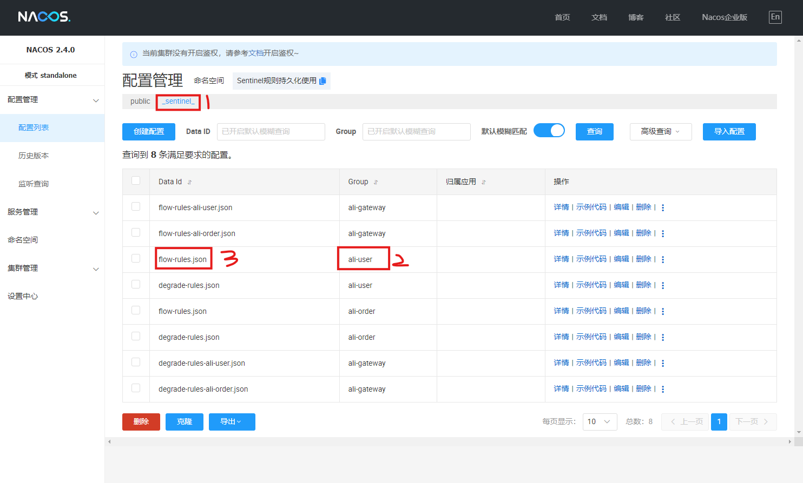

# spring-cloud-ali

[TOC]

> 此项目作为Spring Cloud Alibaba的脚手架工程，便于学习和复现一些系统问题。

## 一、版本管理

### 1.1 框架版本

+ 统一框架版本，可以[参考该链接](https://github.com/alibaba/spring-cloud-alibaba/wiki/%E7%89%88%E6%9C%AC%E8%AF%B4%E6%98%8E)，切勿单独设置：

  ```xml
  <!-- 顶级pom.xml -->
  
  <!-- spring boot -->
  <parent>
      <groupId>org.springframework.boot</groupId>
      <artifactId>spring-boot-starter-parent</artifactId>
      <version>2.6.13</version>
      <relativePath/>
  </parent>
  
  <dependencyManagement>
  	<dependencies>
          <!-- spring cloud -->
          <dependency>
              <groupId>org.springframework.cloud</groupId>
              <artifactId>spring-cloud-dependencies</artifactId>
              <version>2021.0.5</version>
              <type>pom</type>
              <scope>import</scope>
          </dependency>
          <!-- spring cloud alibaba -->
          <dependency>
              <groupId>com.alibaba.cloud</groupId>
              <artifactId>spring-cloud-alibaba-dependencies</artifactId>
              <version>2021.0.6.0</version>
              <type>pom</type>
              <scope>import</scope>
          </dependency>
  	</dependencies>
  </dependencyManagement>
  ```

### 1.2 依赖包版本

1. 所有依赖包及版本定义，均放在`pom.xml`中的`dependencyManagement`中，模块直接引入，如：

   ```xml
   <dependencyManagement>
   	<dependencies>
           <!-- 数据库相关（MySQL) -->
           <dependency>
               <groupId>mysql</groupId>
               <artifactId>mysql-connector-java</artifactId>
               <version>8.0.33</version>
           </dependency>
           <dependency>
               <groupId>com.alibaba</groupId>
               <artifactId>druid-spring-boot-starter</artifactId>
               <version>1.2.8</version>
           </dependency>
           <dependency>
               <groupId>com.baomidou</groupId>
               <artifactId>mybatis-plus-boot-starter</artifactId>
               <version>3.4.3.4</version>
           </dependency>
           ...
       </dependencies>
   </dependencyManagement>
   ```

2. 所有模块强依赖的包，放在`dependencies`中，如：

   ```xml
   <!-- 所有module都需要强依赖的包 --> 
   <dependencies>
       <dependency>
           <groupId>org.projectlombok</groupId>
           <artifactId>lombok</artifactId>
           <version>1.18.26</version>
       </dependency>
   </dependencies>
   ```

3. 引入依赖包前，先确认**框架版本**里，是否已经有**对应的依赖包**定义，有则直接在模块中引入，没有则自行引入

4. 自行引入的依赖包，最好提前确认是否可以引入，是否存在间接依赖包冲突等

## 二、模块划分

|     模块名称      |                           模块用途                           |                             备注                             |
| :---------------: | :----------------------------------------------------------: | :----------------------------------------------------------: |
|  **ali-common**   | 公共模块，大部分业务模块需要依赖，<br />主要包含一些常用工具、组件等 | 该模块中添加依赖包时，<br />通常会定义`provided`<br />确保不会造成强依赖<br />公共组件<br />不应添加@Component注解<br />避免被自动扫描注入<br />由业务手动配置注入 |
|  **ali-gateway**  |       网关模块，提供路由、流控、<br />熔断、鉴权等能力       |      该模块用于治理出入口流量，<br />不负责具体业务逻辑      |
| **ali-user-api**  |           用户服务API<br />提供用户HTTP/RPC接口等            |  调用方可直接引用<br />依赖包通常很少<br />尽量为`provided`  |
|   **ali-user**    |          用户服务实现<br />对api模块的业务逻辑实现           |                        调用方不能引用                        |
| **ali-order-api** |           订单服务API<br />提供用户HTTP/RPC接口等            |  调用方可直接引用<br />依赖包通常很少<br />尽量为`provided`  |
|   **ali-order**   |          订单服务实现<br />对api模块的业务逻辑实现           |                        调用方不能引用                        |

## 三、配置管理

### 3.1 本地配置

> 本地配置(bootstrap.xml)，仅包含少量基础配置，其余配置均放在配置中心。

```yaml
server:
  port: 8002

spring:
  application:
    name: ali-order
  profiles:
    active:
  cloud:
    nacos:  # 使用nacos作为配置和服务注册中心
      config:
        server-addr: 127.0.0.1:8000
        file-extension: yaml
        group: DEFAULT_GROUP
        extension-configs:
          - dataId: ali-common.${spring.cloud.nacos.config.file-extension}
            refresh: true
      discovery: 
        server-addr: 127.0.0.1:8000
```

### 3.2 配置中心（Nacos）

> 配置中心通常包含两部分：通用配置(ali-common.yaml)和应用配置(ali-user.yaml, ali-order.yaml, ...)。

#### 3.2.1 通用配置

> 业务应用公共配置项，如数据源，Web配置等：

```yaml
## ali-common.yaml
spring:
  codec:        # 限制请求体的最大内存大小为10MB
    max-in-memory-size: 10MB
  servlet:      # 限制请求和文件上传大小
    multipart:
      max-file-size: 10MB 
      max-request-size: 15MB 
  web:          
    resources:  # 禁止静态资源映射，如/error
      add-mappings: false
  mvc:          # 当path不存在时，抛出异常
    throw-exception-if-no-handler-found: true
  datasource:   # 数据源配置
    type: com.alibaba.druid.pool.DruidDataSource
    driver-class-name: com.mysql.cj.jdbc.Driver
    username: root
    password: ge3zosQ23F
    url: jdbc:mysql://172.25.0.95:31623/spring-cloud-ali?characterEncoding=utf8&zeroDateTimeBehavior=convertToNull&useSSL=false&useJDBCCompliantTimezoneShift=true&useLegacyDatetimeCode=false&allowMultiQueries=true&allowPublicKeyRetrieval=true&rewriteBatchedStatements=true
    filters: stat,slf4j
    initial-size: 1
    max-active: 50
    min-idle: 5
    test-on-borrow: false
    test-while-idle: true
    test-on-return: false
    validation-query: select 1
    stat-view-servlet:
      enabled: true
      url-pattern: /druid/*
      login-username: admin
      login-password: admin
    filter:
      stat:
        enabled: true
        log-slow-sql: true
        slow-sql-millis: 10000
        merge-sql: false
      wall:
        config:
          multi-statement-allow: true
  redis:
    host: 172.25.0.95
    port: 30108
    password: xhEt7SNFqA

# Mybatis-Plus配置
mybatis-plus:     
  mapper-locations: classpath:/mapper/*.xml
  type-aliases-package: spring.cloud.ali.**.model
  global-config:
    db-config:
      id-type: auto
      logic-delete-field: deleted
      logic-not-delete-value: 0
      logic-delete-value: 1

# feign配置    
feign:          
  client:
    config:
      default:   # 默认设置，也可通过name区分配置
        connectTimeout: 5000  
        readTimeout: 5000
```

#### 3.2.2 应用配置

> 应用配置项，如一些业务开关策略等：

```yaml
## ali-user.yaml
user:
  nickname: 'ALCDxxX'

spring:
  cloud:
    sentinel:
      nacos:
        namespace: '2023a079-1676-44ab-8e5d-d70d02a2a0f7'   
      transport:
        # 这个端口是会在业务应用内启动一个Http Server，与Sentinel控制台交互
        port: 18001
        dashboard: localhost:8010
```

#### 3.2.3 配置监听

> Nacos默认开启了配置监听，业务应用可用通过`@RefreshScope`注解，来监听及刷新：

```java
@Data
@RefreshScope
@ConfigurationProperties(prefix = "user")
@Component
public class AppConfig {

    private String nickname;
}
```

#### 3.2.4 组件配置

> 组件配置，是指业务应用经常会使用到的基础组件，通常会在ali-common中实现并提供配置类（如[CommonConfig](./spring-cloud-ali-common/src/main/java/spring/cloud/ali/common/config/CommonConfig.java)、[WebConfig](./spring-cloud-ali-common/src/main/java/spring/cloud/ali/common/config/WebConfig.java)等），但不会强制引入，业务方需自行引入，如：

```java
@Import({CommonConfig.class, WebConfig.class, RedisConfig.class})
@Configuration
public class ComponentConfig {

}
```

## 四、服务治理

### 4.1 安全规范

#### 4.1.1 系统安全

#### 4.1.2 身份认证

> 身份认证即账号认证，对于需要用户登陆的场景，应引导用户认证并授权，在后续操作中，携带相关授权信息。

1. **授权**：参考[UserController#login](spring-cloud-ali-user/src/main/java/spring/cloud/ali/user/controller/UserController.java)接口，登陆成功会发放**token**；

2. **鉴权**：业务请求需携带第1步发放的**token**，网关层进行拦截鉴权，参考[RouteLoginFilter](spring-cloud-ali-gateway/src/main/java/spring/cloud/ali/gateway/filter/RouteLoginFilter.java)；

3. **上下文传递**：

   1. 经过网关拦截认证后，请求头携带`Login-User-Id`；
   2. 微服务拦截器，通过请求头初始化登陆上下文，参考[LoginInterceptor](spring-cloud-ali-common/src/main/java/spring/cloud/ali/common/component/web/LoginInterceptor.java)；
   3. 当服务之间次级调用时，需将上下文继续传递，参考[FeignClientConfig](spring-cloud-ali-common/src/main/java/spring/cloud/ali/common/config/FeignClientConfig.java)；

4. 当存在线程池调用时，为<font color="red">**避免上下文丢失**</font>，应使用[TTL](https://github.com/alibaba/transmittable-thread-local/blob/master/docs/requirement-scenario.md)构建上下文和线程池：

   ```java
   // 定义TransmittableThreadLocal
   TransmittableThreadLocal<String> context = new TransmittableThreadLocal<>();
   
   // 在主线程中设置上下文
   context.set("Main Thread Context");
   
   // 提交到线程池执行任务时，上下文将被传递
   ExecutorService executor = TtlExecutors.getTtlExecutorService(Executors.newFixedThreadPool(10));
   executor.submit(() -> {
       System.out.println("Context: " + context.get()); // 输出 Main Thread Context
   });
   ```

#### 4.1.3 服务鉴权

#### 4.1.4 数据安全

### 4.2 异常规范


### 4.3 日志规范


### 4.4 流控规范

> 1. **网关流控**：针对外网流量作入口流控（尽量将限流控制在最外层），属于必要流控；
> 2. **服务流控**：针对单一服务对外流控，包含了来自网关和内部服务的流量，属于兜底流控（必须）；
> 3. **流控实现**：采用Sentinel和Nacos（持久化），网关和服务流控采用隔离配置（不同文件），实际情况也考虑使用统一文件；
> 4. 这里的流控，更多是指**被调用方自限流**，也可作**他限流**（调用方主动流控）；
> 5. 若需要在Sentinel控制台修改规则并生效，需改动控制台代码，将规则更新请求，转发至Nacos(publishConfig)，而不是应用客户端Transport端口）

#### 4.4.1 网关流控

> 网关内，会集成很多服务应用，且请求API无法预先注册（**可通过服务API列表自动初始化配置**），Sentinel原生只支持**路由（Route）**和**API分组**维度的流控，**API维度**需自行实现，结合Nacos作规则持久化，可实现动态配置，参考[GlobalSentinelFilter类](./spring-cloud-ali-gateway/src/main/java/spring/cloud/ali/gateway/filter/GlobalSentinelFilter.java)实现：

+ 流控规则，复用对应routeId（服务名）的`flow-rules.json`文件；


#### 4.4.2 服务流控

> 服务流控，作为服务**兜底流控**，应进行策略配置，结合**Spring MVC Interceptor**、**Sentinel**和**Nacos**实现限流拦截器，可参考[WebInterceptor类](spring-cloud-ali-common/src/main/java/spring/cloud/ali/common/component/web/WebInterceptor.java)实现：

+ 流控规则配置文件：

  

  1. `_sentinel_`：存放sentinel规则的配置命名空间

  2. `ali-user`：使用微服务应用名称，作为配置分组

  3. `flow-rules.json`：微服务应用流控规则配置：

     ```json
     [
         {
             "resource": "GET#/users/detail", // METHOD#URI
             "limitApp": "default",
             "grade": 1,
             "count": 3,
             "strategy": 0,
             "controlBehavior": 0,
             "clusterMode": false
         },
         {
             "resource": "GET#/users/{userId}",
             "limitApp": "default",
             "grade": 1,
             "count": 1,
             "strategy": 0,
             "controlBehavior": 0,
             "clusterMode": false
         }
     ]
     ```

### 4.5 熔断降级

> 降级主要针对应用外部调用场景，当外部服务持续不可用时，应作及时熔断降级，降低雪崩风险。场景主要包含**网关调用内部服务**、**内部服务间调用**、**中间件调用**、**第三方调用**等

#### 4.5.1 网关调用内部服务

> 通过网关路由的应用接口，默认接入降级能力，业务需在Nacos中配置相关接口熔断降级规则，具体实现可参考[GlobalSentinelFilter类](./spring-cloud-ali-gateway/src/main/java/spring/cloud/ali/gateway/filter/GlobalSentinelFilter.java)实现，如需对订单应用接口作熔断降级：

+ 降级规则，复用对应routeId（服务名，如ali-user）的`degrades-rules.json`文件；

+ 配置详情：（资源标识：请求方法#请求路径）

  

#### 4.5.2 内部服务间调用

> 服务内依赖的服务调用（如feign），默认接入降级能力，具体实现可参考[WrappedFeignClient](spring-cloud-ali-common/src/main/java/spring/cloud/ali/common/component/web/WrappedFeignClient.java)、[FeignClientConfig](spring-cloud-ali-common/src/main/java/spring/cloud/ali/common/config/FeignClientConfig.java)，应用api接口需要配置**FeignClientConfig**：

```java
@Bean
public WrappedFeignClient wrappedFeignClient(){
    return new WrappedFeignClient(new Client.Default(null, null));
}

@Bean
public FeignClientConfig feignClientConfig(){
    return new FeignClientConfig();
}

@FeignClient(name = "ali-user", configuration = FeignClientConfig.class)
public interface UserHttpService {

    @GetMapping("/users/detail")
    HttpResult<UserDetailResult> queryUserByName(@RequestParam String userName);

    @GetMapping("/users/{userId}")
    HttpResult<UserDetailResult> queryUserById(@PathVariable Long userId);
}
```

**Nacos**中的降级规则配置：


1. `_sentinel_`：存放sentinel规则的配置命名空间
2. `ali-order`：当前应用名称
3. `degrade-rules-feign.json`：feign调用降级规则文件


1. `limitApp`：应用标识，和`@FeignClient`中的`name`一致，为了确保不同应用可能存在相同的path
2. `resource`：资源标识，请求方法#请求路径

#### 4.5.3 中间件调用

##### 4.5.3.1 redis

> redis调用通常在查询缓存时，可作降级处理，具体实现可参考[RedisInterceptor](spring-cloud-ali-common/src/main/java/spring/cloud/ali/common/component/db/RedisInterceptor.java)，业务应用需根据具体的redis操作配置对应降级规则，当前支持降级的数据类型：**value**、**list**、**set**、**zset**、**hash**。

**Nacos**中的降级规则配置：


1. `_sentinel_`：存放sentinel规则的配置命名空间
2. `ali-user`：当前应用名称
3. `degrade-rules-redis.json`：redis操作降级规则文件


+ `resource`：资源标识，数据类型#操作方法#操作key

#### 4.5.4 第三方调用


### 4.6 监控报警

> 监控主要基于**Spring Boot Actuator**及**Micrometer**（集成）、**Prometheus**（采集）、**Grafana**（可视化&报警），主要覆盖**系统监控**、**JVM监控**、**接口监控**、**日志监控**、**业务监控**等

#### 4.6.1 监控集成

1. 引入actuator和micrometer依赖：

   ```xml
    <dependency>
       <groupId>org.springframework.boot</groupId>
       <artifactId>spring-boot-starter-actuator</artifactId>
   </dependency>
   <dependency>
       <groupId>io.micrometer</groupId>
       <artifactId>micrometer-registry-prometheus</artifactId>
   </dependency>
   ```

2. 开启指标配置：

   > [!WARNING]
   >
   > 为确保端口访问安全，应结合Spring Security增加账号或IP访问安全策略！

   ```yaml
   management:
     endpoints:
       web:
         exposure:
           include: "*"
     endpoint:
       health:
         show-details: always
     metrics:
       enable:
         all: true
       tags:
         enabled: true
       export:
         prometheus:
           enabled: true
   ```

3. 确保启动`prometheus`后，配置targets：

   > [!WARNING]
   >
   > 对于服务实例较多的场景，应结合服务注册中心，实现自动化采集

   ```yml
   global:
     scrape_interval: 15s
     evaluation_interval: 15s
   
   scrape_configs:
     - job_name: "prometheus"
       static_configs:
         - targets: ["localhost:9090"]
     - job_name: "ali-gateway"
       metrics_path: '/actuator/prometheus'
       static_configs:
         - targets: ["localhost:8888"]
     - job_name: "ali-user"
       metrics_path: '/actuator/prometheus'
       static_configs:
         - targets: ["localhost:8001"]
     - job_name: "ali-order"
       metrics_path: '/actuator/prometheus'
       static_configs:
         - targets: ["localhost:8002"]
   ```

4. 确保启动`grafana`后，并配置`prometheus`数据源后，便可配置Dashboard和Panel，可参考该配置文件[grafana-ali-gateway-dashboard.json](doc/grafana-ali-gateway-dashboard.json)（建议先统一监控模板规则，应用到不同微服务即可）

5. 对于自定义指标，只需注入`MeterRegistry`进行指标统计，可参考[GlobalMetricFilter](spring-cloud-ali-gateway/src/main/java/spring/cloud/ali/gateway/filter/GlobalMetricFilter.java)。

#### 4.6.2 报警管理

### 4.7 链路跟踪

> 用于分布式环境中，跟踪请求的跨系统调用路径，便于排查和依赖分析。在Spring Cloud生态中，主要基于**Spring Cloud Sleuth**和**Zipkin**来实现跟踪。（新版已迁移至[Micrometer](https://docs.micrometer.io/tracing/reference/index.html))

#### 4.7.1 链路集成

1. 引入相关依赖：

   ```xml
   <dependency>
       <groupId>org.springframework.cloud</groupId>
       <artifactId>spring-cloud-starter-sleuth</artifactId>
   </dependency>
   <dependency>
       <groupId>org.springframework.cloud</groupId>
       <artifactId>spring-cloud-sleuth-zipkin</artifactId>
   </dependency>
   ```

2. 确保已启动`zipkin`，增加相关配置：

   ```yaml
   spring:
     zipkin:
       base-url: http://localhost:9411
     sleuth:
       sampler:
         probability: 1.0
   ```

#### 4.7.2 链路扩展

1. **数据库**跟踪集成，参考[TracingInterceptor](spring-cloud-ali-common/src/main/java/spring/cloud/ali/common/component/db/TracingInterceptor.java)；
2. **消息队列**跟踪集成，参考[RocketMQProducer](spring-cloud-ali-common/src/main/java/spring/cloud/ali/common/component/mq/RocketMQProducer.java)、[RocketMQConsumer](spring-cloud-ali-common/src/main/java/spring/cloud/ali/common/component/mq/RocketMQConsumer.java)。

#### 4.7.3 其他

1. 默认情况下，应用通过http请求上报数据，建议替换为MQ；
2. 默认情况下，zipkin数据仅内存存储，建议替换为ES。

### 4.8 系统压测


### 4.9 系统诊断


## 五、开发规范


## 六、运维部署
